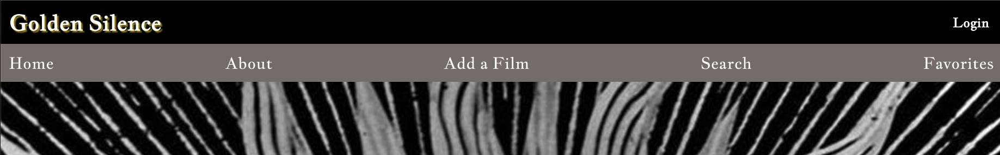
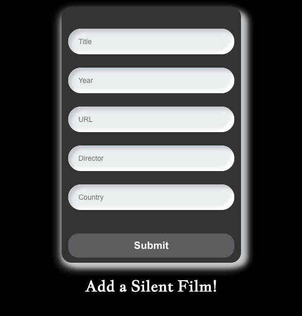
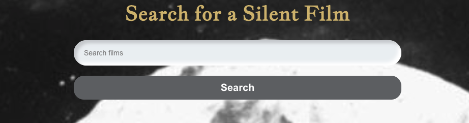
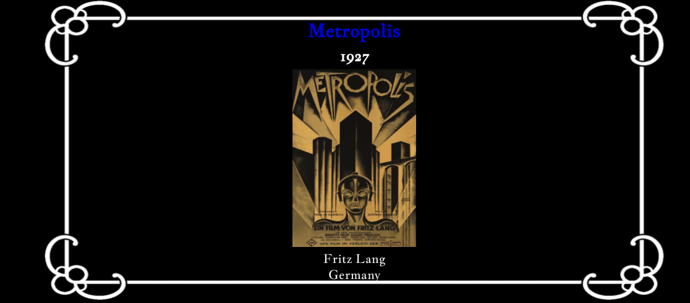
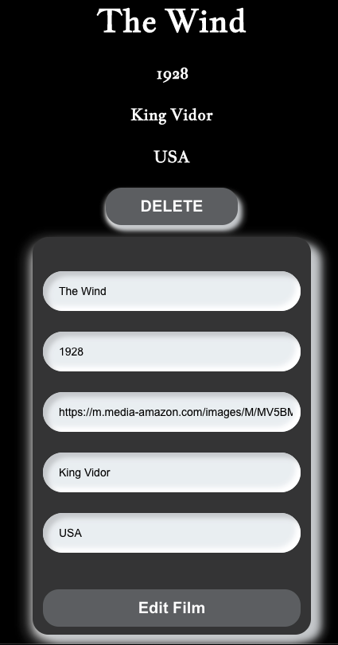

# Golden Silence App 

Allows users to look up silent films from the 1920's and build a collection of their favorite films.

# Getting Started

Sign up and log in. In the home page you can search the database for silent films and view details. Go to the add a films page to add, edit, or delete from the collection. 

# Technologies Used

- HTML, CSS, JavaScript/jQuery
- Mongoose
- MongoDB
- Heroku
- Node JS
- Express
- React
- Netlify

# Screenshots

https://golden-silence.netlify.app

# Future Enhancements

- Allow users to check which films they have watched. 
- Allow users to comment and review films

